<!-- Reference:
https://github.com/othneildrew/Best-README-Template -->

<!-- PROJECT LOGO -->
 

  <h1><i> Cyber Solve </i></h1>

  
  .

  

    A practical implementer & stepwise analyzer for CCNS techniques  !
  

 

<!-- TABLE OF CONTENTS -->

  
Table of Contents

  <ol>
    <li><a href="#about-the-project">About The Project</a></li>
    <li><a href="#built-with">Built With</a></li>
    <li><a href="#getting-started">Getting Started</a></li>
    <li><a href="#setup-and-use">Setup and Use</a></li>
    <li><a href="#license-or-author">License or Author</a></li>
    <li><a href="#contact">Contact</a></li>
    <li><a href="#acknowledgments">Acknowledgments</a></li>
  </ol>

 

<!-- ABOUT THE PROJECT -->
## About The Project
  * Developed an application to generate simplified results for complex techniques and algorithms used in ‘Computer Cryptography and Network Security (CCNS)’.
  * Also provided the option of detailed analysis, by allowing step-by-step tracing of each implementation.

  <spacer height="10" width="10"></spacer>

  ##### The techniques covered include the following:
  1. Caesar Cipher
  2. Rail-fence Cipher
  3. Columnar Transposition
  4. Playfair Cipher
  5. Hill Cipher
  6. One-time pad
  7. Extended Euclidian Algorithm
  8. DES (Data Encryption Standard)
  9. RSA (Rivest-Shamir-Adleman)
  10. Diffie-Hellman Key Exchange

  
(<a href="#readme-top">back to top</a>)

## Built With
  &nbsp; &nbsp; &nbsp; &nbsp; &nbsp; 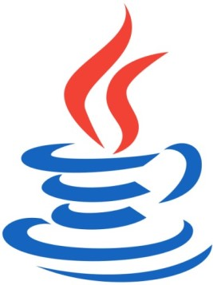

  &nbsp; &nbsp; &nbsp; &nbsp; &nbsp; &nbsp; &nbsp; <b><i> Java </i></b>

  
(<a href="#readme-top">back to top</a>)

<!-- GETTING STARTED -->
## Getting Started
  #### Prerequisites
  * Java, JDK, JRE
  * IDE - Netbeans (Preferred)
  * Launch4j - Cross-platform Java Executable Wrapper
  * Machine Requirements: Minimum 4GB RAM, Intel i5 Processor (or Equivalent)

  
  #### Setup and Use
  * ###### Using Source Code 
    1. Get the source code from <b>'Java Project/CCNS_Practicals/'</b>.
    2. Import the source code to IDE.
    3. Build and run using IDE's inbuild features.

  * ###### Directly using Executable
    1. Get <b>'Cyber Solve.exe'</b> or <b>'Cyber Solve.exe'</b> from the parent directory.
    2. Run the executable on your windows machine.

  
 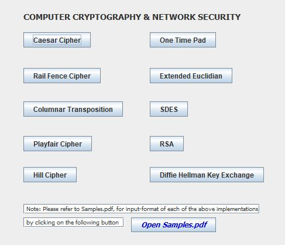 &nbsp &nbsp 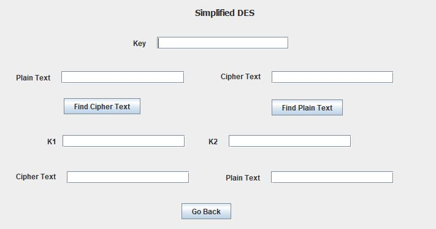 

  
(<a href="#readme-top">back to top</a>)

<!-- Some Sample Examples -->
## Some Sample Examples
To try out the application first-hand, you can use the following examples.
A similar step-wise analysis can be performed when running the application with <b>console</b>, via the IDE.

#### Examples:
  (Can also be found in <b>'Requirements/Samples.pdf'</b>)
  * ##### <u>Caesar Cipher</u>
      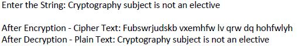

  * ##### <u>Rail-fence Cipher</u>
      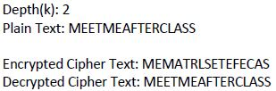

  * ##### <u>Columnar Transposition</u>
      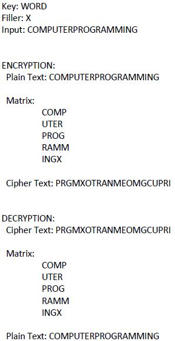

  * ##### <u>Playfair Cipher</u>
      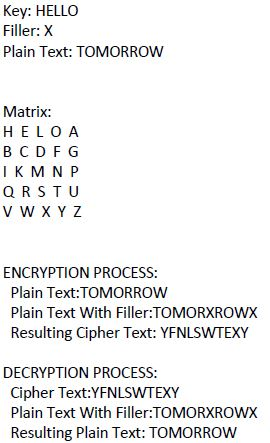
      
  * ##### <u>Hill Cipher</u>
      

  * ##### <u>One-time pad</u>
      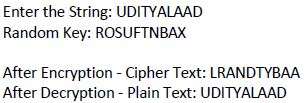

  * ##### <u>Extended Euclidian Algorithm</u>
      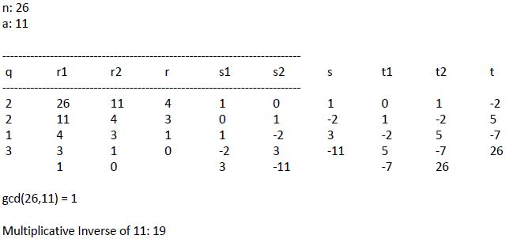

  * ##### <u>DES (Data Encryption Standard)</u>
      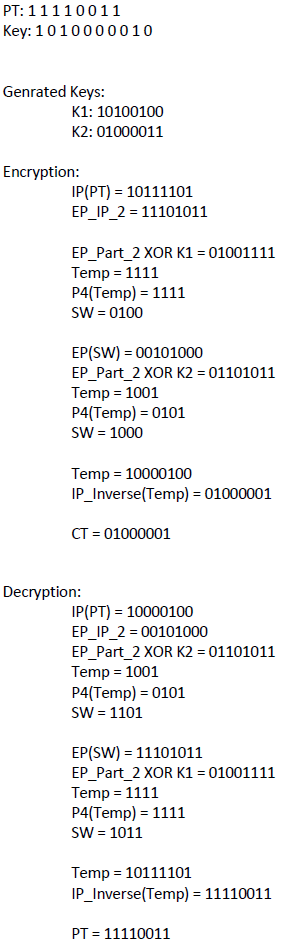

  * ##### <u>RSA (Rivest-Shamir-Adleman)</u>
      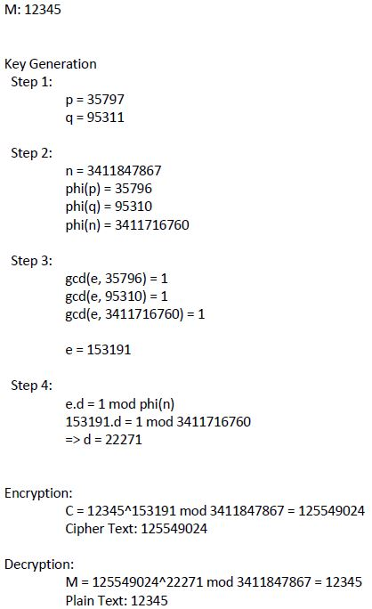

  * ##### <u>Diffie-Hellman Key Exchange</u>
      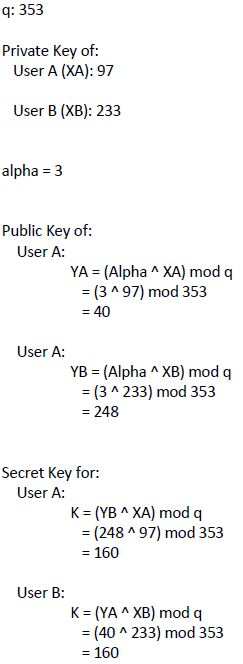

<!-- LICENSE -->
## License or Author
  * Uditya Laad, Goa College of Engineering, Goa University, GA, IN

  
(<a href="#readme-top">back to top</a>)

<!-- CONTACT -->
## Contact
  <b>Uditya Laad</b> &nbsp; [@linkedin.com/in/uditya-laad-222680148](https://www.linkedin.com/in/uditya-laad-222680148/)
  
  &nbsp; &nbsp; &nbsp; &nbsp; &nbsp; &nbsp; &nbsp; &nbsp; &nbsp; &nbsp; &nbsp; [@github.com/udityalaad](https://github.com/udityalaad)
  
  &nbsp; &nbsp; &nbsp; &nbsp; &nbsp; &nbsp; &nbsp; &nbsp; &nbsp; &nbsp; &nbsp; udityalaad123@gmail.com

  <b>Project Link</b> &nbsp; [https://github.com/udityalaad/Cyber_Solve](https://github.com/udityalaad/Cyber_Solve)

  
(<a href="#readme-top">back to top</a>)

<!-- ACKNOWLEDGMENTS -->
## Acknowledgments
  * [github.com/othneildrew/Best-README-Template/](https://github.com/othneildrew/Best-README-Template)
  * [Cyber Wallpapers](https://wallpaper.dog/cyber-wallpapers)
  
  
(<a href="#readme-top">back to top</a>)

